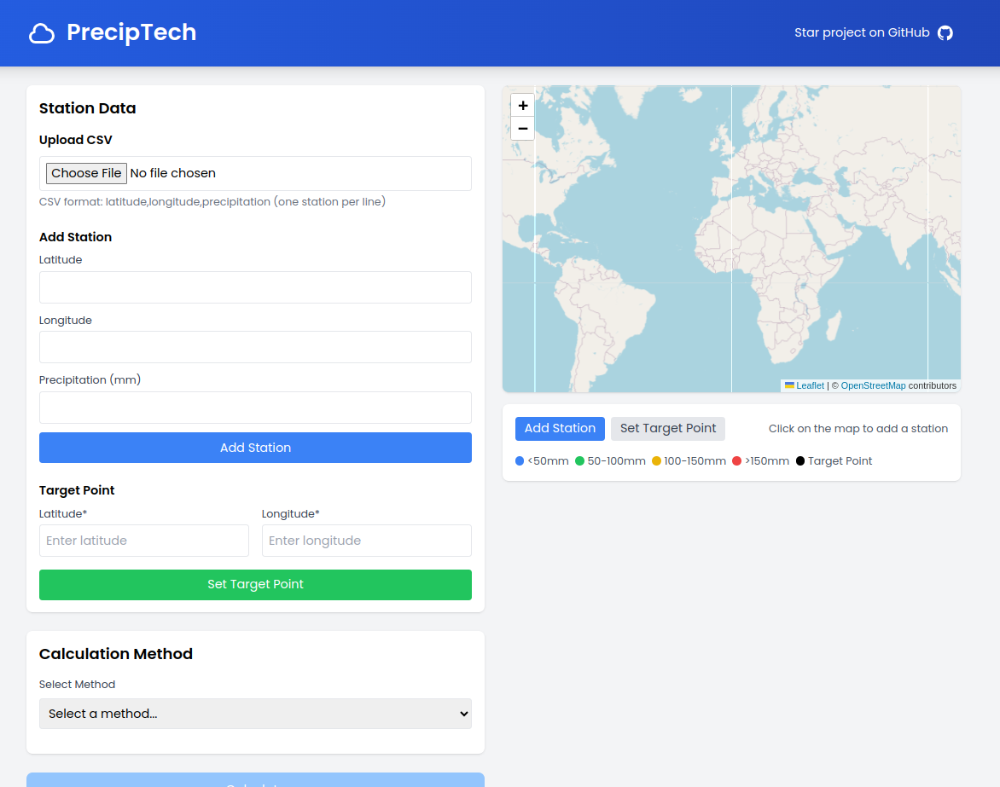

# PrecipTech 

A modern web application for calculating precipitation at any point using various interpolation methods.



## Features

- Interactive map interface for adding stations and selecting target points
- Calculate precipitation at any point using multiple methods:
  - Arithmetic Mean
  - Normal Ratio
  - Inverse Distance Weighting (IDW)
  - Thiessen Polygon Method
  - Isohyetal Method
- Visual representation of results with:
  - Color-coded station markers
  - Thiessen polygons visualization
  - Isohyetal contours
- Dynamic result map showing:
  - Station locations and values
  - Target point
  - Method-specific visualization
- Responsive design that works on desktop and mobile

## Installation

1. Clone the repository:
```bash
git clone https://github.com/deepaksilaych/preciptech.git
cd preciptech
```

2. Install dependencies:
```bash
npm install
```

3. Start the development server:
```bash
npm start
```

4. Open [http://localhost:3000](http://localhost:3000) in your browser

## Usage

1. **Add Precipitation Stations**:
   - Click the "Add Station" button (blue)
   - Click on the map or enter coordinates manually
   - Enter the precipitation value for each station

2. **Set Target Point**:
   - Click the "Set Target Point" button (green)
   - Click on the map or enter coordinates manually

3. **Calculate Precipitation**:
   - Select a calculation method
   - Click "Calculate" to see results
   - View the visualization on the result map

## Calculation Methods

### 1. Arithmetic Mean
Simple average of all station values. Best for:
- Uniform precipitation distribution
- Stations evenly distributed
- Small areas

### 2. Normal Ratio
Weighted average based on normal annual precipitation. Best for:
- Areas with varying precipitation patterns
- Long-term data available

### 3. Inverse Distance Weighting (IDW)
Weights stations based on distance from target. Best for:
- Irregular station distribution
- Gradual precipitation changes

### 4. Thiessen Polygon
Area-weighted average using Voronoi diagrams. Best for:
- Non-uniform station distribution
- Medium to large areas
- When station density varies

### 5. Isohyetal
Uses precipitation contours. Best for:
- Complex terrain
- When topographic effects are important
- Dense station network

## Technologies Used

- React
- Leaflet & React-Leaflet for maps
- D3.js for visualizations
- Tailwind CSS for styling

## Contributing

1. Fork the repository
2. Create your feature branch (`git checkout -b feature/AmazingFeature`)
3. Commit your changes (`git commit -m 'Add some AmazingFeature'`)
4. Push to the branch (`git push origin feature/AmazingFeature`)
5. Open a Pull Request

## License

This project is licensed under the MIT License - see the [LICENSE](LICENSE) file for details.

## Acknowledgments

- Thiessen Polygon method by A.H. Thiessen
- OpenStreetMap for map tiles
- React and D3.js communities for excellent tools
